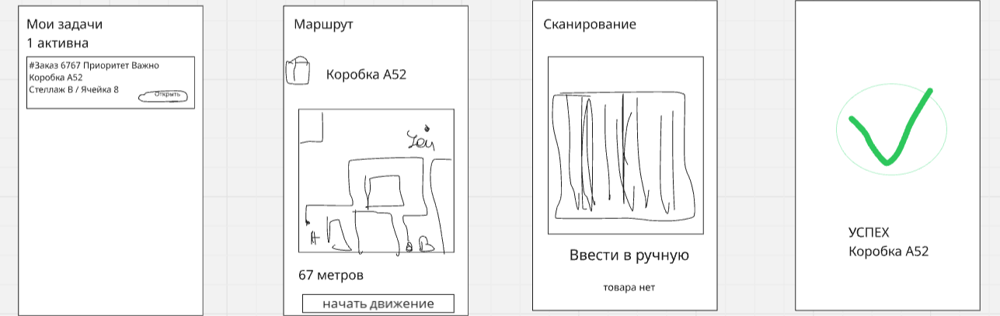
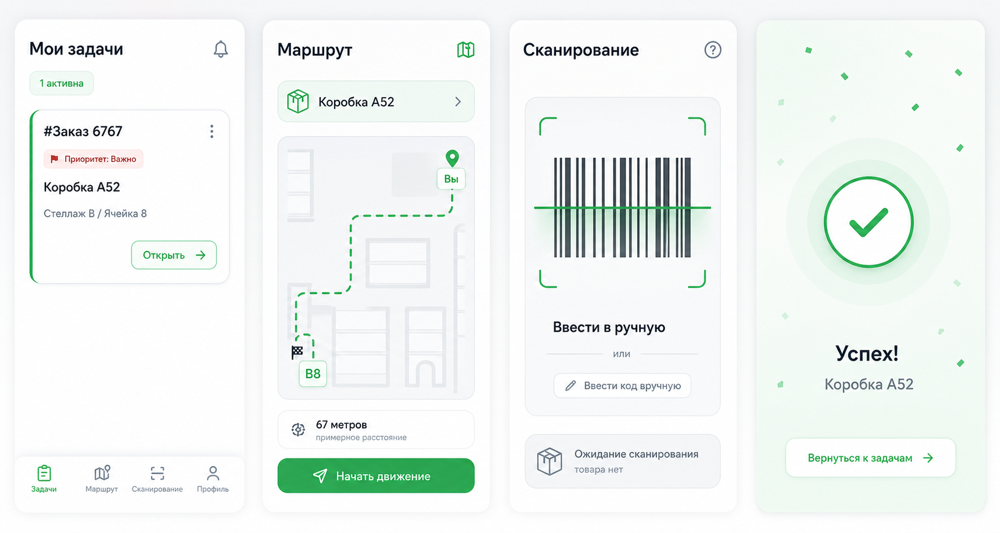
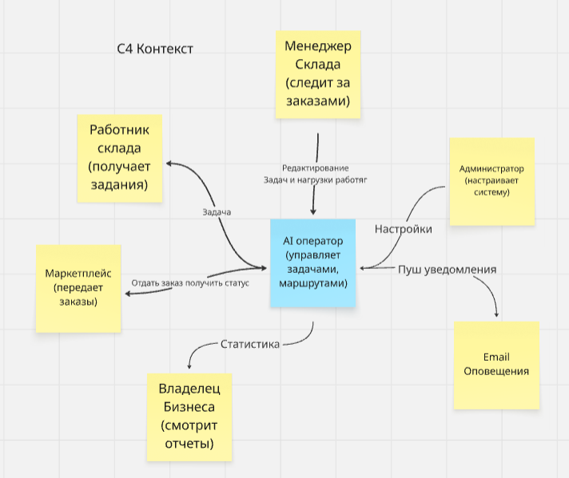
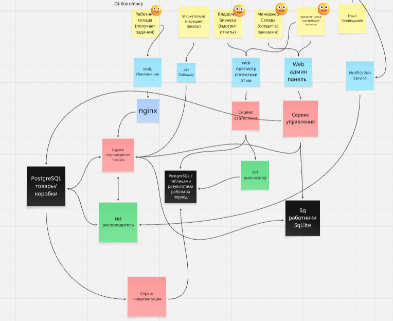

# 2026-VK-EDU-ITProject-Management-13-Izmaylov-M

## Краткое описание
Мы создаём AI-оператора склада - систему, которая в реальном времени управляет работой сотрудников: автоматически распределяет задачи, строит оптимальные маршруты и контролирует выполнение
заказов. В отличие от классических WMS, она не просто показывает данные, а принимает решения и даёт конкретные инструкции каждому работнику. Это позволяет складам ускорить обработку заказов,
снизить ошибки и повысить эффективность без увеличения штата.

[Ссылка на доску Miro](https://miro.com/app/board/uXjVHefSmfc=/?share_link_id=547423769792)

## Задание 1
**LEAN CANVAS**


---
1. СЕГМЕНТЫ ПОТРЕБИТЕЛЕЙ
- владельцы складов
- e-commerce компании
- логистические операторы

ранние последователи:
- малые/средние склады
- бизнесы без автоматизации
- склады с ручной сборкой

2. ПРОБЛЕМА
- неэффективные маршруты работников
- ручное управление складом
- ошибки и задержки в сборке заказов

существующие альтернативы:
- WMS
- Excel
- менеджеры вручную

3. УНИКАЛЬНАЯ ЦЕННОСТЬ

AI, который управляет складом вместо менеджера
Увеличьте эффективность склада на 30% без найма людей

4. РЕШЕНИЕ
- AI-распределение задач
- автоматическая маршрутизация
- мобильное приложение для работников
- dashboard для контроля

5. КАНАЛЫ
- холодные письма складам
- LinkedIn outreach
- прямые продажи (B2B)
- партнёрства с логистикой

6. ПОТОКИ ПРИБЫЛИ
- SaaS подписка
- оплата за пользователя
- платные интеграции
- enterprise лицензии

7. СТРУКТУРА ИЗДЕРЖЕК
- разработка (backend + AI)
- серверы / облако
- продажи
- поддержка
- внедрение

8. КЛЮЧЕВЫЕ МЕТРИКИ
- время сборки заказа
- количество заказов/час
- длина маршрута работника
- количество ошибок
- retention клиентов

9. СКРЫТОЕ ПРЕИМУЩЕСТВО
- собственные алгоритмы оптимизации
- накопление данных (обучение системы)
- простое внедрение без сложной интеграции

---

**ELEVATOR PITCH**
Склады теряют до 30% эффективности из-за плохой координации сотрудников и ручного управления процессами.
Мы создаём AI-оператора склада, который в реальном времени распределяет задачи, строит оптимальные маршруты и управляет загрузкой персонала.
В отличие от классических WMS-систем, мы не просто показываем данные, а принимаем решения и даём конкретные инструкции каждому работнику.
В результате склады ускоряют обработку заказов, снижают ошибки и экономят на операционных расходах.

Или фомулировка через метод 5-ти пальцев
Метод 5 пальцев
1. Проблема
- Склад работает неэффективно: сотрудники тратят время впустую, а решения принимаются вручную.

2. Решение
- AI распределяет задачи и строит маршруты в реальном времени.

3. Киллер-фича
- Система сама говорит каждому работнику, что делать дальше.

4. Профит
- +30% скорость работы, меньше ошибок, меньше менеджеров.

5. CTA
- Ищем пилотные склады. Готовы внедрить бесплатно на старте.

## Задание 2

**РОЛИ**
1. Складской работник
2. Менеджер склада
3. Владелец бизнеса
4. Администратор системы

**USER STORIES**
_Работник склада_
- Найти следующую задачу для выполнения
- Получить оптимальный маршрут по складу
- Отсканировать товар
- Подтвердить выполнение задачи
- Получить следующую задачу автоматически
- Сообщить об ошибке (нет товара / брак)
- Посмотреть список задач

_Менеджер склада_
- Видеть загрузку сотрудников
- Видеть статус заказов в реальном времени
- Перераспределить задачи вручную
- Получить уведомление о задержке
- Смотреть аналитику эффективности

_Владелец_
- Смотреть общую эффективность склада
- Смотреть отчёты по производительности
- Видеть узкие места

_Админ_
- Добавить склад
- Загрузить заказы (CSV/API)
- Настроить карту склада
- Добавить сотрудников
- Управлять доступами

---

**MoSCoW never sleep приоритизация**

MUST (обязательно — без этого продукт не работает)
- получение задачи работником
- отображение маршрута
- сканирование товара
- подтверждение выполнения задачи
- загрузка заказов (CSV/API)
- базовый статус заказов

SHOULD (важно, но мб потом)
- ручное перераспределение задач менеджером
- уведомления о проблемах
- обработка ошибок (нет товара / неверный товар)
- базовый dashboard менеджера
- очередь задач

COULD (улучшает UX / вау-эффект)
- AI-оптимизация маршрутов
- прогноз задержек
- аналитика эффективности
- удобный UI/UX
- авто-перераспределение задач

WON’T (не делаем сейчас)
- сложные интеграции с ERP/WMS
- продвинутая BI-аналитика
- кастомизация под enterprise
- multi-warehouse orchestration

---

**MVP (Minimum Viable Product - скелет)**

Работник
- получить задачу
- видеть маршрут до товара
- сканировать товар
- подтвердить выполнение

Менеджер
- загрузить заказы (CSV/API)
- видеть статус заказов

**MLP (Minimum Lovable Product - чтобы полюбили)**
- уведомления о проблемах
- dashboard менеджера
- авто-перераспределение задач
- AI-оптимизация маршрутов
- аналитика эффективности
- удобный UI

---

**Некторые ФТ и НФТ**

1. Работник получает маршрут и выполняет задачу

ФТ (функциональные требования)
- система назначает задачу сотруднику
- система показывает локацию товара
- система строит маршрут до точки
- система обновляет маршрут после выполнения
- система позволяет перейти к следующей задаче

НФТ (нефункциональные требования)
- построение маршрута ≤ 1 сек
- система выдерживает ≥ 50 сотрудников одновременно
- интерфейс работает без лагов
- доступность системы ≥ 99%
- корректная работа при слабом интернете

---

2. Работник сканирует товар и подтверждает

ФТ
- система открывает камеру  
- система считывает штрихкод
- система сравнивает с ожидаемым товаром
- система подтверждает выполнение
- система обновляет статус заказа

НФТ
- сканирование ≤ 0.5 сек
- точность распознавания ≥ 95%
- обработка запроса ≤ 1 сек
- кеширование данных при оффлайн работе
- защита от двойного подтверждения

## Задание 3
**DDD**
1) Управление задачами
Domain: Task Management
_Краткое описание_
Эта зона отвечает за то, какую задачу должен выполнять сотрудник, в какой последовательности и когда задача считается завершённой.

_Что входит_
- назначение задачи сотруднику
- смена статуса задачи
- очередь задач
- подтверждение выполнения
- фиксация проблем по задаче

_Поддомены_
- Task — действие, которое должен выполнить работник склада
- Task Status - новое / в работе / выполнено / проблема
- Assignee - сотрудник, которому назначена задача
- Priority - важность задачи относительно других

2) Навигация и маршрутизация
Domain: Routing & Navigation
_Краткое описание_
Эта зона отвечает за построение оптимального маршрута по складу для выполнения задач.

_Что входит_
- карта склада
- точки хранения товара
- построение маршрута
- пересчёт маршрута при изменениях
- оптимизация последовательности обхода

_Поддомены_
- Route - последовательность точек, по которым должен пройти сотрудник
- Location - зона, стеллаж или ячейка на складе
- Pick Point - место, где нужно забрать товар
- Route Optimization - поиск наиболее эффективного пути

3) Заказы и складские операции
Domain: Order Fulfillment
_Краткое описание_
Эта зона отвечает за заказы, позиции заказа и операции по сборке.

_Что входит_
- импорт заказов
- список товарных позиций
- резервирование товара
- подтверждение отбора
- фиксация недостачи или ошибки

_Поддомены_
- Order - набор товарных позиций
- Order Item - конкретный товар и его количество
- Picking - операция взятия товара
- Stock Shortage - отсутствие товара в ячейке

4) Персонал и роли
Domain: Workforce Management

_Краткое описание_
Эта зона отвечает за сотрудников, их роли, доступы и текущую загрузку.

_Что входит_
- регистрация сотрудников
- роли пользователей
- смены
- текущая занятость
- права доступа

_Поддомены_
- Worker - сотрудник склада
- Manager - контролирует процессы
- Admin - управляет системой
- Shift - рабочий интервал
- Workload - количество задач у сотрудника

5) Мониторинг и аналитика
Domain: Monitoring & Analytics

_Краткое описание_
Эта зона отвечает за отслеживание эффективности склада и выявление проблем.

_Что входит_
- статус заказов в реальном времени
- показатели производительности
- задержки
- узкие места
- история выполнения задач

_Поддомены_
- Metric - показатель эффективности
- Bottleneck - узкое место
- Delay - задержка выполнения
- Performance - производительность склада

*BDD*
Для:
Сотрудник получает задачу -> видит маршрут -> сканирует товар -> подтверждает выполнение

Сценарий успеха

_Дано_
- сотрудник авторизован в системе
- у сотрудника есть активная смена
- в системе есть назначенная ему задача на отбор товара
- товар существует в указанной ячейке
- маршрут до точки отбора успешно построен

_Когда_
- сотрудник открывает экран задач
- выбирает текущую задачу
- переходит по предложенному маршруту
- сканирует товар
- нажимает кнопку «Подтвердить выполнение»

_Тогда_
- система меняет статус задачи на «выполнено»
- система фиксирует время выполнения
- система обновляет статус позиции заказа
- система автоматически выдаёт следующую задачу, если она есть
- менеджер видит обновлённый статус в панели мониторинга

Сценарий отказа

_Дано_
- сотрудник авторизован в системе
- у сотрудника есть назначенная задача
- сотрудник находится в точке отбора
- товар в ячейке отсутствует или был найден не тот штрихкод

_Когда_
- сотрудник сканирует товар
- система проверяет штрихкод
- штрихкод не совпадает с ожидаемым товаром или сотрудник нажимает «Товара нет»

_Тогда_
- система не даёт завершить задачу
- система показывает сообщение об ошибке
- задача получает статус «проблема»
- менеджеру отправляется уведомление о проблемной задаче
- сотруднику предлагается следующая доступная задача или инструкция ожидания

*Wireframes*
Для:
Сотрудник получает задачу -> видит маршрут -> сканирует товар -> подтверждает выполнение

Набросаем дизайн интерфейса


Скормим набросок чату гпт


*Api-First*
JSON для 2 главных ручек
1. Получение следующей задачи сотрудника
2. Подтверждение выполнения задачи после сканирования

_Получить следующую задачу_
Endpoint
GET /api/v1/tasks/next?worker_id=123

```nginx
// Response 200
{
  "task_id": 501,
  "status": "assigned",
  "priority": "high",
  "order": {
    "order_id": 1024
  },
  "item": {
    "sku": "A12-BOX",
    "name": "Коробка A12",
    "quantity": 3,
    "barcode": "4601234567890"
  },
  "location": {
    "zone": "B",
    "rack": "14",
    "cell": "B-14"
  },
  "route": {
    "distance_meters": 42,
    "estimated_seconds": 55,
    "steps": [
      {
        "from": "ENTRY",
        "to": "A-01",
        "instruction": "Идите прямо до зоны A"
      },
      {
        "from": "A-01",
        "to": "B-14",
        "instruction": "Поверните направо к стеллажу B-14"
      }
    ]
  }
}

// Response 404
{
  "error": "NO_TASKS_AVAILABLE",
  "message": "Для сотрудника нет доступных задач"
}
```

_Подтвердить выполнение задачи_
Endpoint
POST /api/v1/tasks/complete

```nginx
// Request
{
  "task_id": 501,
  "worker_id": 123,
  "scanned_barcode": "4601234567890",
  "picked_quantity": 3,
  "completed_at": "2026-04-22T14:32:10Z"
}
// Response 200
{
  "task_id": 501,
  "status": "completed",
  "order_id": 1024,
  "item_status": "picked",
  "completed_at": "2026-04-22T14:32:10Z",
  "next_task_available": true
}
// Response 400
{
  "error": "INVALID_BARCODE",
  "message": "Отсканированный товар не соответствует ожидаемому"
}
  ```
## Задание 4
**C4**

_Контекст_



_Контейнер_



_Стек_
Backend
- Python (FastAPI)
Mobile
- Kotlin (Android)
Web
- TypeScript + React
Database
- PostgreSQL
- MySQL
- Cache
- Redis
Messaging / очереди
- Kafka
Notifications
- Firebase Cloud Messaging
- SMTP / Email сервис
API Gateway / Infra
- Nginx
Контейнеризация
- Docker

## Задание 5
**Hiring Plan**
1. Backend Developer (Python)
Зоны ответственности:
- разработка API (задачи, заказы, маршруты)
- интеграция с БД и внешними сервисами

2. Mobile Developer (Kotlin)
Зоны ответственности:
- приложение для работника склада
- реализация сканирования и UX выполнения задач

3. Frontend Developer (React)
Зоны ответственности:
- dashboard для менеджера и администратора
- отображение статусов, заказов и аналитики

4. Product Manager
Зоны ответственности:
- формирование требований и приоритетов
- взаимодействие с пользователями и сбор фидбека

5. QA Engineer
Зоны ответственности:
- тестирование ключевых сценариев (MVP flow)
- контроль качества и баг-репорты

6. DevOps (part-time)
- деплой и инфраструктура (Docker, сервер)

**Development Framework**
Выбранная методология: Agile (Scrum)
Почему подходит:
продукт новый -> требования меняются -> нужна гибкость
можно быстро проверять гипотезы через MVP
короткие спринты позволяют быстро получать фидбек от складов

**Team Rituals**
1. Daily Standup
Цель: синхронизация команды
Частота: каждый день (15 минут)

2. Sprint Planning
Цель: планирование задач на спринт
Частота: раз в 2 недели

3. Sprint Review
Цель: показать результат и получить фидбек
Частота: раз в 2 недели

4. Retrospective
Цель: улучшение процесса разработки
Частота: раз в 2 недели

5. Demo / Stakeholder Review
Цель: показать продукт бизнесу / заказчику
Частота: раз в 2–4 недели

## Задание 6
1. Сложность внедрения у клиента
     
    Тип: внешний
    
    Уровень: высокий
    
    Проблема: Склады не хотят внедрять новые системы (страх изменений, обучение сотрудников).
    
    Стратегия реагирования:
    максимально простой onboarding (CSV, без интеграций)
    обучение сотрудников (инструкции, демо)
    пилотный запуск на 1 участке склада

2. Низкое качество данных

    Тип: внешний
    
    Уровень: высокий
    
    Проблема: неправильные локации, ошибки в заказах -> система даёт неверные маршруты
    
    Стратегия:
    валидация данных при загрузке
    возможность ручной корректировки
    логирование ошибок

3. Технические ошибки в MVP

    Тип: внутренний
    
    Уровень: средний
    
    Проблема: баги в маршрутах, сканировании или задачах
    
    Стратегия:
    тестирование ключевого user flow
    ограниченный пилот
    быстрый фикс через Agile

4. Низкое принятие пользователями (работники)

    Тип: внешний
    
    Уровень: высокий
    
    Проблема: сотрудники игнорируют систему -> работают “по-старому”
    
    Стратегия:
    простой UI
    минимальные действия (1–2 клика)
    показать выгоду (меньше ходить, проще работать)

5. Конкуренция (WMS системы)

    Тип: внешний
    
    Уровень: средний
    
    Проблема: существуют крупные решения (SAP, WMS)
    
    Стратегия:
    фокус на SMB (малые склады)
    простота внедрения
    дешевле и быстрее

6. Масштабируемость системы

    Тип: внутренний
    
    Уровень: средний
    
    Проблема: при росте пользователей система может тормозить
    
    Стратегия:
    заложить масштабируемую архитектуру
    использовать Docker
    позже добавить кеш (Redis) и очереди (Kafka)

_Оценка_
1. Сложность внедрения у клиента  
  Тип: внешний
  Вероятность: 3  
  Влияние: 3  
  Итоговый риск: 9  

2. Низкое качество данных  
  Тип: внешний
  Вероятность: 3  
  Влияние: 3  
  Итоговый риск: 9  

3. Технические ошибки в MVP  
  Тип: внутренний
  Вероятность: 2  
  Влияние: 3  
  Итоговый риск: 6  

4. Низкое принятие пользователями  
  Тип: внешний
  Вероятность: 3  
  Влияние: 2  
  Итоговый риск: 6  

5. Конкуренция (WMS)  
  Тип: внешний
  Вероятность: 2  
  Влияние: 2  
  Итоговый риск: 4  

6. Масштабируемость  
  Тип: внутренний  
  Вероятность: 2  
  Влияние: 2  
  Итоговый риск: 4  
