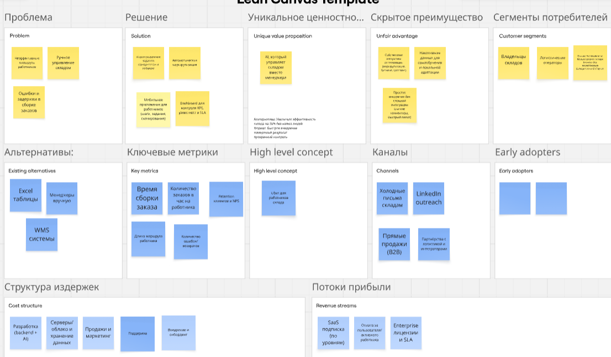

# 2026-VK-EDU-ITProject-Management-13-Izmaylov-M

## Краткое описание
Мы создаём AI-оператора склада - систему, которая в реальном времени управляет работой сотрудников: автоматически распределяет задачи, строит оптимальные маршруты и контролирует выполнение
заказов. В отличие от классических WMS, она не просто показывает данные, а принимает решения и даёт конкретные инструкции каждому работнику. Это позволяет складам ускорить обработку заказов,
снизить ошибки и повысить эффективность без увеличения штата.

[Ссылка на доску Miro](https://miro.com/app/board/uXjVHefSmfc=/?share_link_id=547423769792)

## Задание 1
**LEAN CANVAS**

---
1. СЕГМЕНТЫ ПОТРЕБИТЕЛЕЙ
- владельцы складов
- e-commerce компании
- логистические операторы

ранние последователи:
- малые/средние склады
- бизнесы без автоматизации
- склады с ручной сборкой

2. ПРОБЛЕМА
- неэффективные маршруты работников
- ручное управление складом
- ошибки и задержки в сборке заказов

существующие альтернативы:
- WMS
- Excel
- менеджеры вручную

3. УНИКАЛЬНАЯ ЦЕННОСТЬ

AI, который управляет складом вместо менеджера
Увеличьте эффективность склада на 30% без найма людей

4. РЕШЕНИЕ
- AI-распределение задач
- автоматическая маршрутизация
- мобильное приложение для работников
- dashboard для контроля

5. КАНАЛЫ
- холодные письма складам
- LinkedIn outreach
- прямые продажи (B2B)
- партнёрства с логистикой

6. ПОТОКИ ПРИБЫЛИ
- SaaS подписка
- оплата за пользователя
- платные интеграции
- enterprise лицензии

7. СТРУКТУРА ИЗДЕРЖЕК
- разработка (backend + AI)
- серверы / облако
- продажи
- поддержка
- внедрение

8. КЛЮЧЕВЫЕ МЕТРИКИ
- время сборки заказа
- количество заказов/час
- длина маршрута работника
- количество ошибок
- retention клиентов

9. СКРЫТОЕ ПРЕИМУЩЕСТВО
- собственные алгоритмы оптимизации
- накопление данных (обучение системы)
- простое внедрение без сложной интеграции

---

**ELEVATOR PITCH**
Склады теряют до 30% эффективности из-за плохой координации сотрудников и ручного управления процессами.
Мы создаём AI-оператора склада, который в реальном времени распределяет задачи, строит оптимальные маршруты и управляет загрузкой персонала.
В отличие от классических WMS-систем, мы не просто показываем данные, а принимаем решения и даём конкретные инструкции каждому работнику.
В результате склады ускоряют обработку заказов, снижают ошибки и экономят на операционных расходах.

Или фомулировка через метод 5-ти пальцев
Метод 5 пальцев
1. Проблема
- Склад работает неэффективно: сотрудники тратят время впустую, а решения принимаются вручную.

2. Решение
- AI распределяет задачи и строит маршруты в реальном времени.

3. Киллер-фича
- Система сама говорит каждому работнику, что делать дальше.

4. Профит
- +30% скорость работы, меньше ошибок, меньше менеджеров.

5. CTA
- Ищем пилотные склады. Готовы внедрить бесплатно на старте.

## Задание 2

**РОЛИ**
1. Складской работник
2. Менеджер склада
3. Владелец бизнеса
4. Администратор системы
